# SalaAutomaticaSimulador
Uma simulação de salas automáticas, com um servidor conectando-se aos microcontroladores das salas, assim automatizando processos de ligar e desligar aparelhos.

## Projeto
Com a descrição acima, o projeto é divido em quatro classes:
- SalaAula:
Está localizado a sala, com seus aparelhos, nas quais são computadores e ar-condicionados;
- Client:
Está a implementação do microcontrolador, que irá controlar os aparelhos das salas;
- Server:
Está presente o servidor;
- Util:
Está presente uma classe auxiliar, para ajudar a criação dos Sockets do lado do cliente.

### SalaAula:

Cada aparelho implementa essas funcionalidades, para ligar, desligar e descreveer cada aparelhos contido na sala.
Os aparelhos:

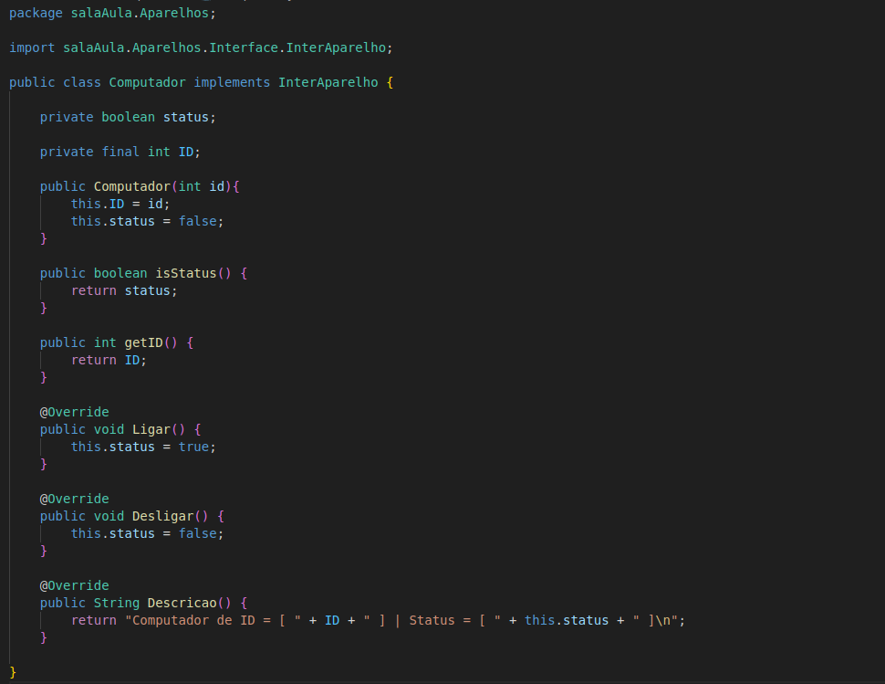
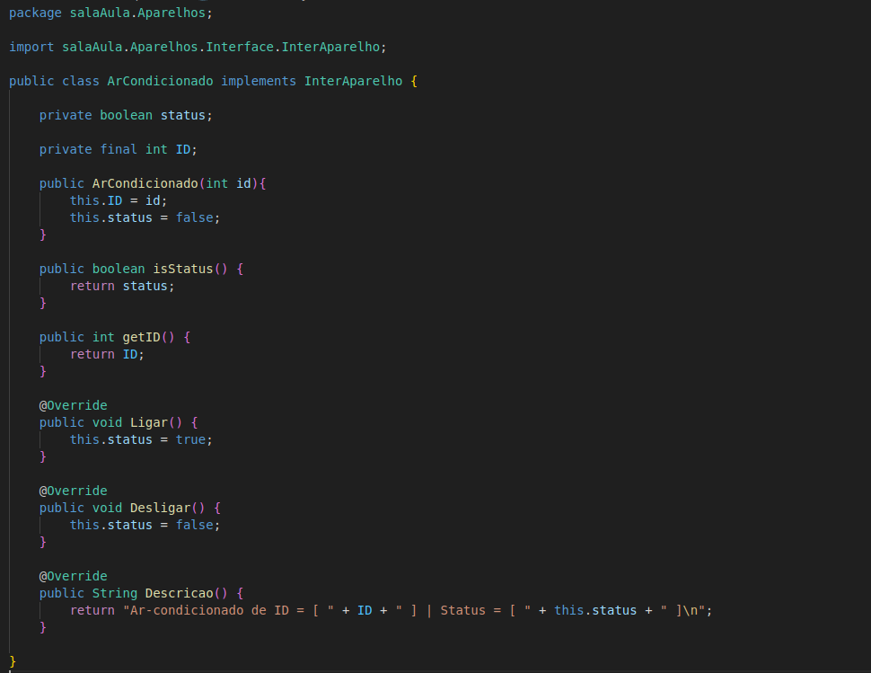

A sala:

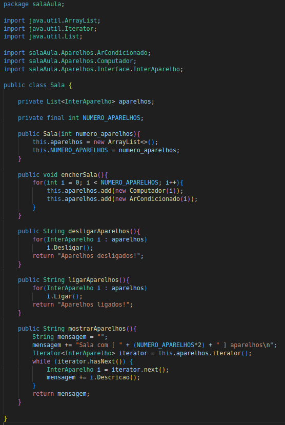

A sala contém uma lista para armazenar todos os aparelhos contido nela e assim poder fazer as funcionalidades pedidias.
O número de aparelhos é dito no construtor da classe.

### Client:
#### A classe Principal é o microcontrolador, na qual irei descrever abaixo:

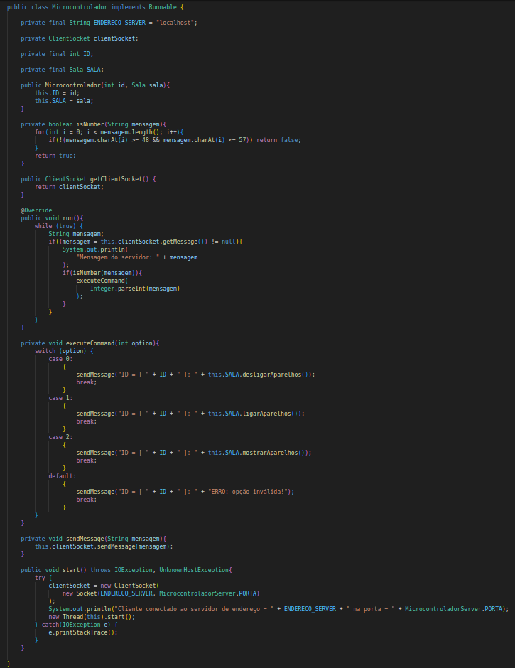

Na construção desta classe, deve-se passar uma sala de aula, para ele ter acesso a todos os aparelhos contida nela.

As principais partes são:
1. Implementação da interface Runnable, para utilização do seu método "run", na qual permite criar uma Thread separada para "escutar" mensagens enviadas do servidor.
2. 
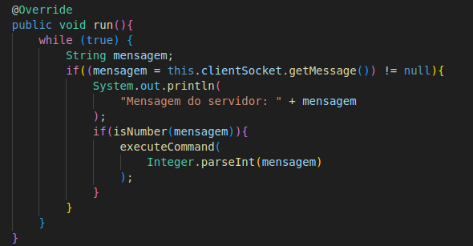

4. Na função "run" é tratado o pedido do servidor, na qual deve ser um número e então é executado o que se pede, como mostra a função abaixo:
5. 
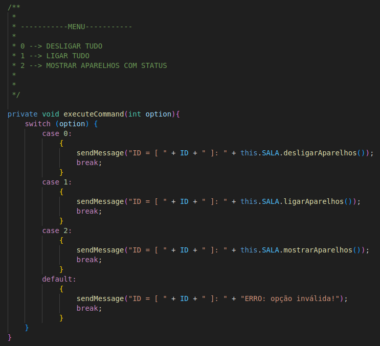

7. Por final é enviado a mensagem de volta ao servidor.
8. 
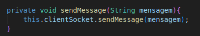

10. Método start, ele inicializa o Socket do cliente, utilizando a classe utilitária, por fim inicializa uma Thread para executar o método "run".
11. 
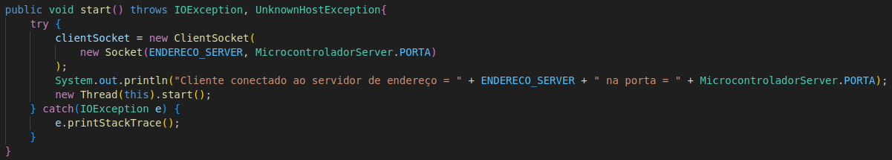

#### A classe Main:

É possível inicializar de duas formas, uma classe inicializando várias instancias de microcontroladores:
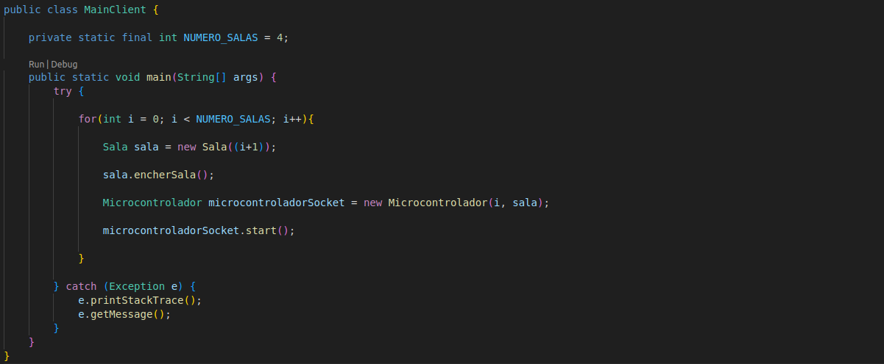
Também é possível inicializar em classes separadas:
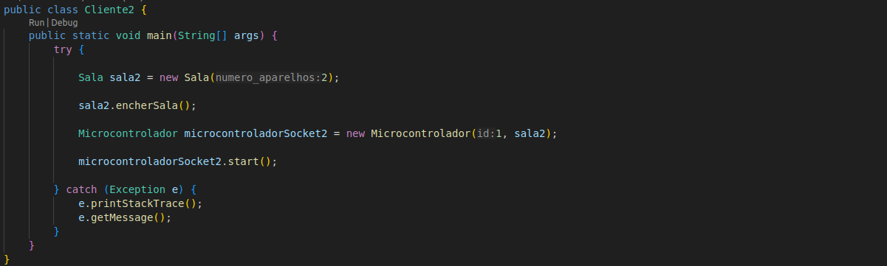

### Server:
#### A classe principal é Server.

As principais partes são:
1. Método start, ele irá subir o SocketServer para receber conexões e executar a função principal.
2. 
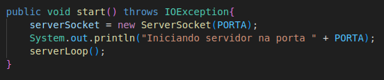

4. Método principal, uma função em loop infinito, é dividio em três partes:
- Receber conexões;

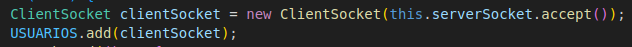

- Thread separada para receber as respostas dos microcontroladores.
  
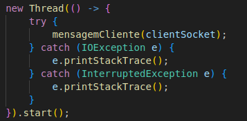

- Thread separada para enviar mensagens aos microcontroladores.
  
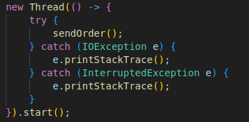

3. Método receber respostas dos microcontroladores.
   
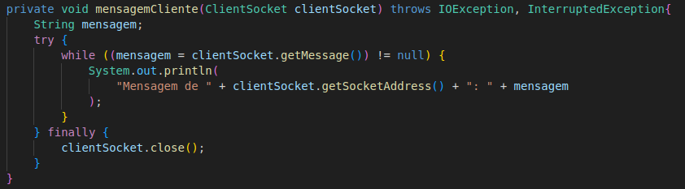

5. Método enviar mensagens, este método é envolto da função "synchronized()", por fim ele chama a função de envio.
   
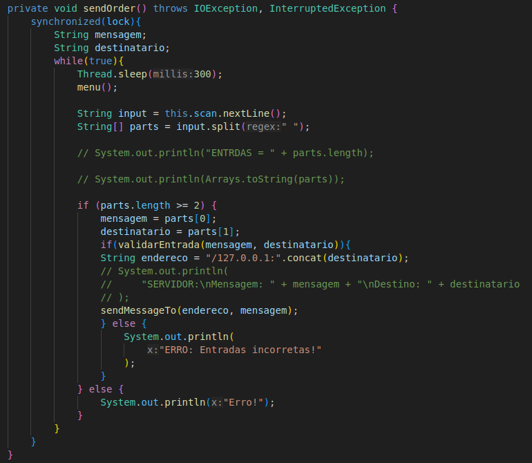

Função de envio:

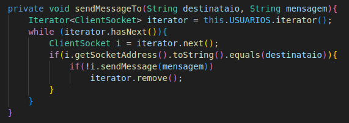

### Util:
#### A classe principal é o ClientSocket.

Esta classe vai ser utilizada peloas microcontroladores, ela vai armazenar o Socket do cliente, assim como os métodos de leitura e escrita.

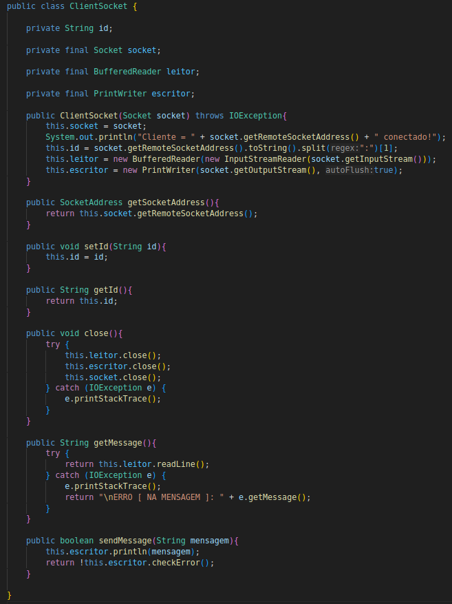
